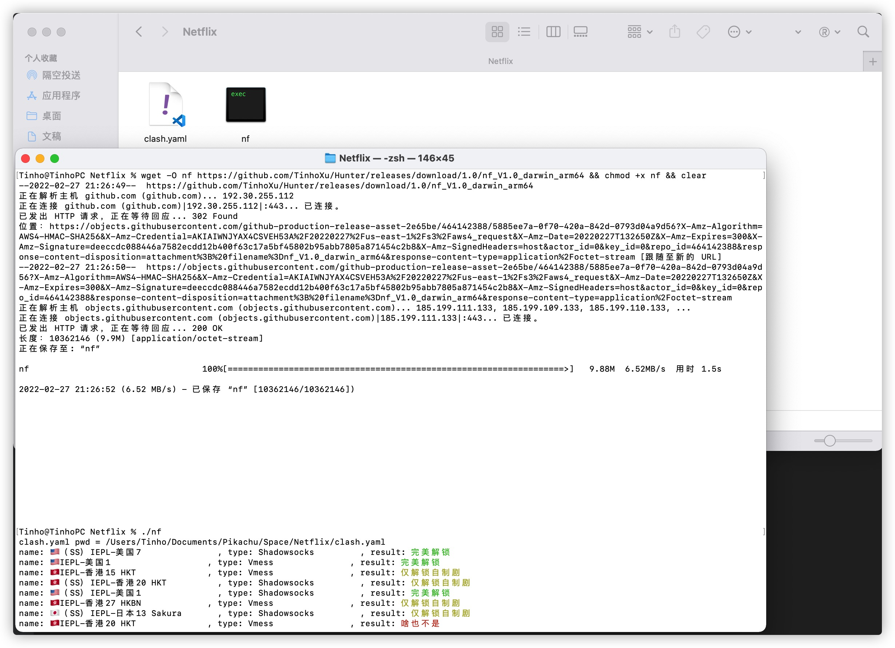

# Hunter

使用 Go 语言编写的，对 Clash 配置文件中的全部节点做 Netflix 解锁检测的脚本  
如果加载 Clash 配置文件失败，则会使用 sjlleo/netflix-verify 校验当前网络的解锁情况  

## 命令行参数

* -path [path] Clash 配置文件的路径，默认寻找当前程序同目录下的 clash.yaml 文件
* -custom [MovieID] 想测试的电影ID号即可查看特定影片是否在该网络上解锁
* -method [method] 模式选择(full/lite)，默认为 lite，一般用不到，详见 sjlleo/netflix-verify
* -address [ip] 本机公网IP，一般用不到，详见 sjlleo/netflix-verify

## 食用方法

wget -O nf https://github.com/TinhoXu/Hunter/releases/download/1.0/nf_V1.0_xxx && chmod +x nf  

./nf -path xxx/clash/config.yaml  
./nf -path xxx/clash/config.yaml -custom 70143836  

ps:  
1.如果指定了 path 参数，则会缓存路径到当前程序目录下的 config.yaml  
2.下次运行时，如果 path 和上次一样，则可以不用再指定，直接 ./nf 运行即可  
3.如果需要使用默认参数（即当前程序目录下的 clash.yaml 文件），则运行 ./nf -path . 即可清除 path 参数

## 鸣谢

* [Dreamacro/clash](https://github.com/Dreamacro/clash)
* [sjlleo/netflix-verify](https://github.com/sjlleo/netflix-verify)

## License

This software is released under the GPL-3.0 license.
